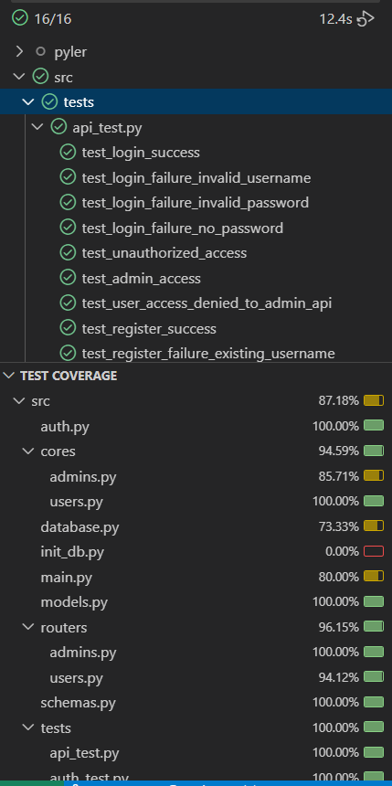

# Video Hub
파일러 과제. 유튜브 정보 수집 및 통계 제공 서비스. 

**구현 Stack**: Python 3.11, FastAPI, SQLAlchemy, Postgresql

## 실행방법
1. ``` docker-compose.yml up ```


DB -> 기본 테이블 및 데이터 Initialize -> API 서버 순으로 실행 됨

2. 아래 활용방법을 이용해 API를 활용해보면 된다.

## 활용방법
1. localhost:8000/docs에 접근해 인증/인가 서버 명세 확인 및 API 테스트 수행.
2. localhost:8001/docs에 접근해 비디오 허브 서버 명세 확인 및 API 테스트 수행.
3. 로그인 방법 : Authorize 내에 필요한 권한을 가진 username/password 입력.

 


## 테스팅


1. 최상단 requirements.txt를 활용하여 로컬에 python 가상환경 구축. 

2. ``` docker-compose.yml up ```을 통해 **test_db**와 **pyler_auth_test**컨테이너가 가동.

3. 테스트 하고싶은 서비스의 경로로 .vscode/settings.json의 "python.testing.cwd"의 값을 바꾼다.

4. vscode Testing Extension을 활용하여 로컬 환경에서 테스트 진행.

**test_db 컨테이너** (localhost:5433, id:test,pwd:test1!)
**pyler_auth_test 컨테이너** (localhost:9999/docs, 계정과 권한은 아래 실제 서버와 상동)


## 서비스 설명
### 1. 인증/인가 서버
유저에 대한 회원가입, 인증, 권한 확인, 권한 부여 서비스. 

현재는 admin/user 권한만 존재함.

user : video 조회

admin : 계정 admin 권한 부여, video 추가/삭제, video 조회

| username | pwd | role |
|--|--|--|
|sampleuser|samplepassword|user|
|simon|simon|user|
|pyler|pyler1!|admin|

#### 제공 API List

1. 회원 가입
2. 로그인
3. \[관리자\]권한 추가 (수정, 삭제 미구현)

#### 테이블 List

1. 유저 마스터
2. 권한 마스터
3. 유저 - 권한 M:M

### 2. 비디오 허브 API 서버
유튜브 정보 수집 및 통계 제공 서비스.
#### 제공 API List

1. Video 전체 조회
2. Video 1개 조회
3. \[관리자\]Video 1개 등록
4. \[관리자\] Video 1개 삭제

#### 테이블 List

1. 비디오 메타 정보
2. 비디오 통계 시계열

## 리소스
### 1. API 명세서
1. [Auth Swagger Docs](http://localhost:8001/docs)
2. [Video Hub SwaggerDocs](http://localhost:8000/docs)
3. [video_hub_openapi.json](resources/video_hub_openapi.json)
4. [auth_openapi.json](resources/auth_openapi.json)
